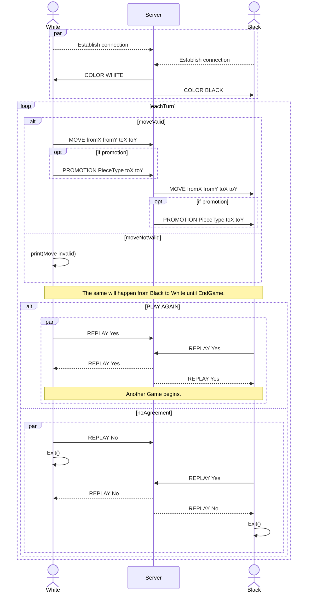

# Practical Work 2 - Chess server
## Overview
## Transport protocol
## Messages

### Server to client

* ```COLOR <color>``` :  The server sends the color of the player to the client when there are two players connected.
    * ```<color>``` : WHITE or BLACK
* ```MOVE <fromX> <fromY> <toX> <toY>``` : The server sends the move of the opponent to the client. All coordinates must
be between 0 and 7.
    * ```<fromX>``` : The X coordinate of the piece to move.
    * ```<fromY>``` : The Y coordinate of the piece to move.
    * ```<toX>``` : The X coordinate of the destination.
    * ```<toY>``` : The Y coordinate of the destination.
* ```PROMOTION <ordinalPieceType> <toX> <toY>``` : The server sends the promotion of the opponent to the client. All
coordinates must be between 0 and 7. Will only be sent to the server if there is a move before.
    * ```<ordinalPieceType>``` : The ordinal of the piece type.
      *  ```1``` : Rook
      *  ```2``` : Knight
      *  ```3``` : Bishop
      *  ```4``` : Queen
    * ```<toX>``` : The X coordinate of the destination.
    * ```<toY>``` : The Y coordinate of the destination.
* ```REPLAY <answer>``` : The server sends "Yes" to the client if both players want to play again, otherwise "No".
    * ```<answer>``` : Yes or No
* ```ERROR <orsinalErrorType>``` : The client will create an error message with the error type. The received message will
be replaced by the error message. The message will not be sent to the server.
    * ```<orsinalErrorType>``` : The ordinal of the error type.
      *  ```1``` : INVALID_MESSAGE - Shown if the message is not the spectated one or if the message is not in the list.
      *  ```2``` : INVALID_NBR_ARGUMENTS - Shown if the number of arguments is not the expected one.
      *  ```3``` : INVALID_MOVE - Shown if the move is not valid.
      *  ```4``` : INVALID_PROMOTION - Shown if the piece type is not valid.
      *  ```5``` : INVALID_REPLAY - Shown if the replay answer is not valid.
      *  ```6``` : INVALID_COLOR - Shown if the color is not valid.

### Client to server
* ```MOVE <fromX> <fromY> <toX> <toY>``` : The client sends the that he has done to the server. All coordinates must be
between 0 and 7.
    * ```<fromX>``` : The X coordinate of the piece to move.
    * ```<fromY>``` : The Y coordinate of the piece to move.
    * ```<toX>``` : The X coordinate of the destination.
    * ```<toY>``` : The Y coordinate of the destination.
* ```PROMOTION <ordinalPieceType> <toX> <toY>``` : The client sends the promotion that he has done to the server.
    * ```<ordinalPieceType>``` : The ordinal of the piece type.
        *  ```1``` : Rook
        *  ```2``` : Knight
        *  ```3``` : Bishop
        *  ```4``` : Queen
* ```REPLAY <answer>``` : The client sends "Yes" to the server if he wants to play again, otherwise "No".
    * ```<answer>``` : Yes or No
* ```ERROR <orsinalErrorType>``` : The client will create an error message with the error type. The received message will
  be replaced by the error message. The message will not be sent to the server.
    * ```<orsinalErrorType>``` : The ordinal of the error type.
        *  ```1``` : INVALID_MESSAGE - Shown if the message is not the spectated one or if the message is not in the list.
        *  ```2``` : INVALID_NBR_ARGUMENTS - Shown if the number of arguments is not the expected one.
        *  ```3``` : INVALID_MOVE - Shown if the move is not valid.
        *  ```4``` : INVALID_PROMOTION - Shown if the piece type is not valid.
        *  ```5``` : INVALID_REPLAY - Shown if the replay answer is not valid.
        *  ```6``` : INVALID_COLOR - Shown if the color is not valid.

## Messages examples


