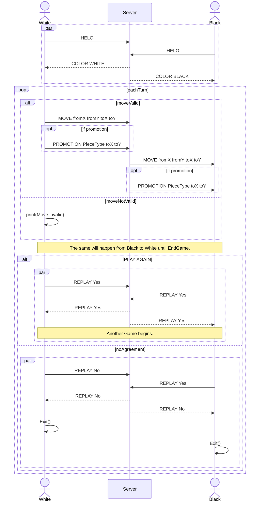

# Practical Work 2 - Chess server
## Overview
## Transport protocol
## Messages

### Server to client

* ```COLOR <color>``` :  The server sends the color of the player to the client when there are two players connected.
  * <color> : WHITE or BLACK
* ```MOVE <fromX> <fromY> <toX> <toY>``` : The server sends the move of the opponent to the client.
  * ```<fromX>``` : The X coordinate of the piece to move.
  * ```<fromY>``` : The Y coordinate of the piece to move.
  * ```<toX>``` : The X coordinate of the destination.
  * ```<toY>``` : The Y coordinate of the destination.
* ```PROMOTION <pieceType> <toX> <toY>``` : The server sends the promotion of the opponent to the client.
* ```REPLAY <answer>``` : The server sends "Yes" to the client if both players want to play again, otherwise "No".
  * ```<answer>``` : Yes or No

### Client to server
* ```MOVE <fromX> <fromY> <toX> <toY>``` : The client sends the that he has done to the server.
  * ```<fromX>``` : The X coordinate of the piece to move.
  * ```<fromY>``` : The Y coordinate of the piece to move.
  * ```<toX>``` : The X coordinate of the destination.
  * ```<toY>``` : The Y coordinate of the destination.
* ```PROMOTION <pieceType> <toX> <toY>``` : The client sends the promotion that he has done to the server.
* ```REPLAY <answer>``` : The client sends "Yes" to the server if he wants to play again, otherwise "No".
  * ```<answer>``` : Yes or No

## Messages examples

